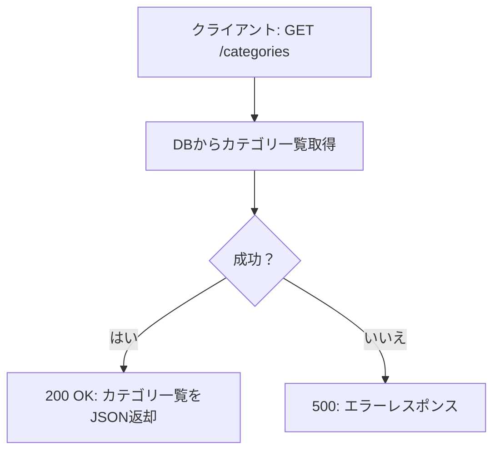
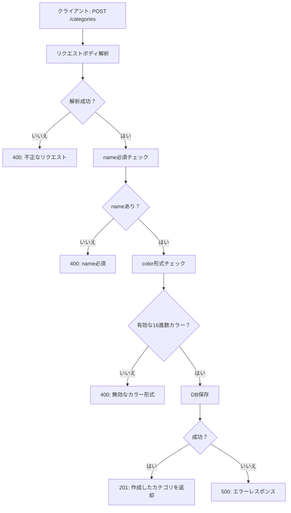
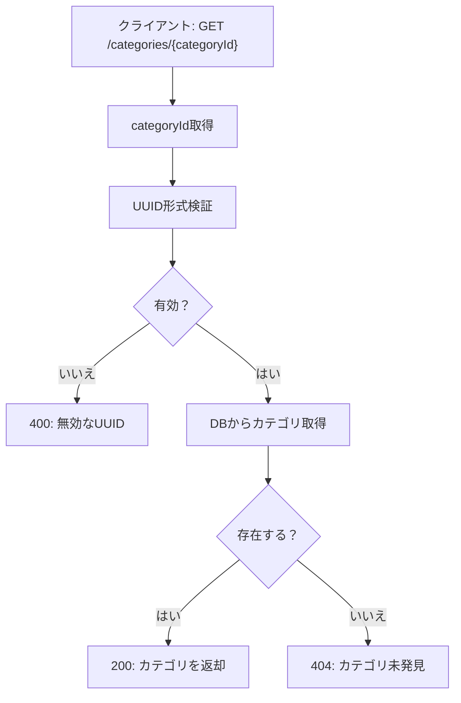
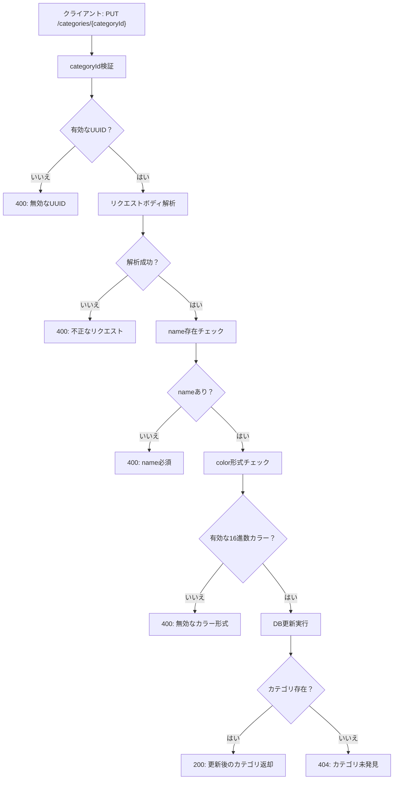
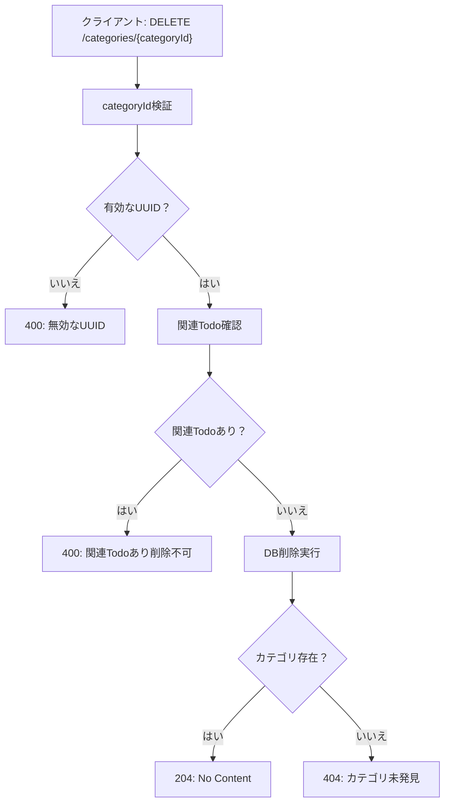

# Category API 処理フロー図

## 1. GET /categories - カテゴリ一覧取得



## 2. POST /categories - カテゴリ作成



## 3. GET /categories/{categoryId} - 特定カテゴリ取得



## 4. PUT /categories/{categoryId} - カテゴリ更新



## 5. DELETE /categories/{categoryId} - カテゴリ削除



## HTTPステータスコード一覧

| ステータス | 説明 | 使用場面 |
|---------|------|---------|
| 200 | OK | 取得・更新成功 |
| 201 | Created | 作成成功 |
| 204 | No Content | 削除成功 |
| 400 | Bad Request | 不正なリクエスト/UUID/カラー形式/関連Todo存在 |
| 404 | Not Found | カテゴリ未発見 |
| 500 | Internal Server Error | サーバーエラー |

## バリデーションルール

### name (カテゴリ名)
- 必須フィールド
- 1文字以上50文字以下
- 空文字列不可

### color (カラーコード)
- オプショナルフィールド
- 6桁の16進数形式（例: #FF5733, #00AA00）
- 先頭の#は必須
- 大文字小文字は区別しない

### categoryId
- UUID v4形式
- 例: 123e4567-e89b-12d3-a456-426614174000

## エラーレスポンス形式

```json
{
  "error": "エラーメッセージ"
}
```