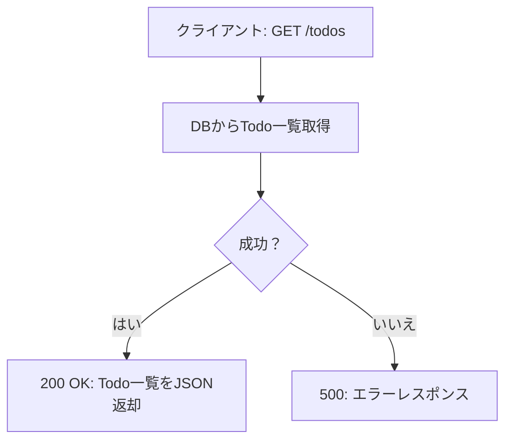
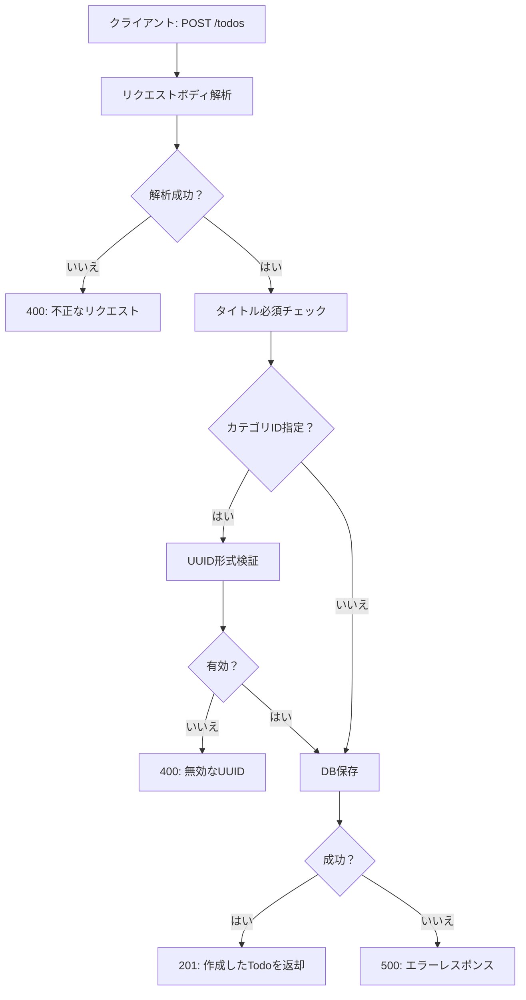
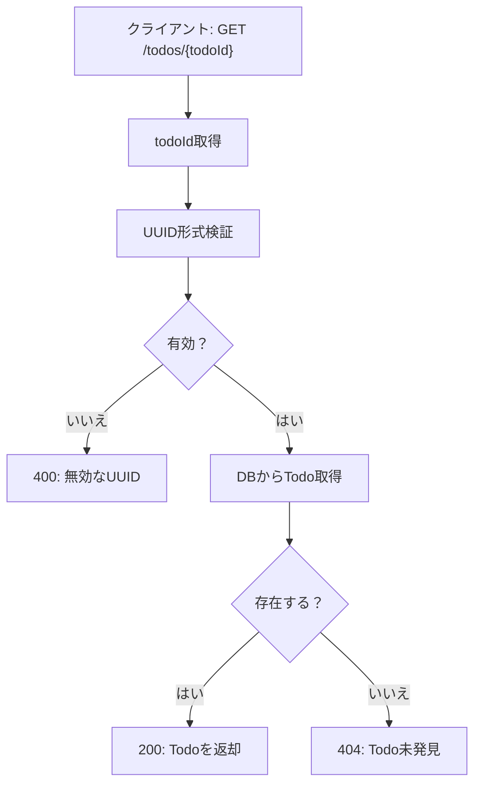
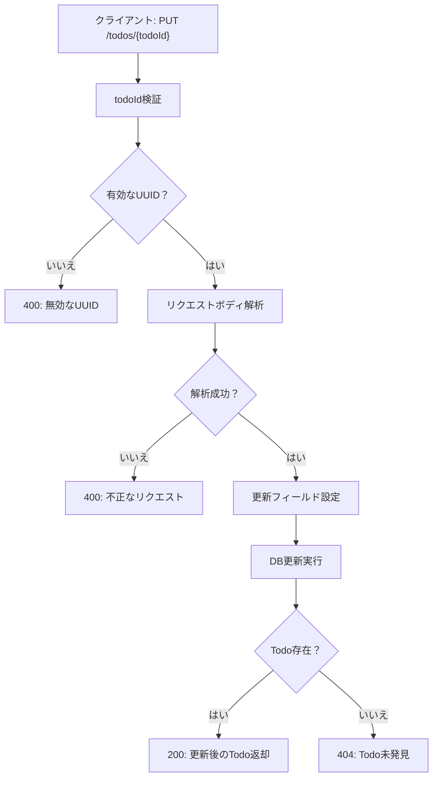
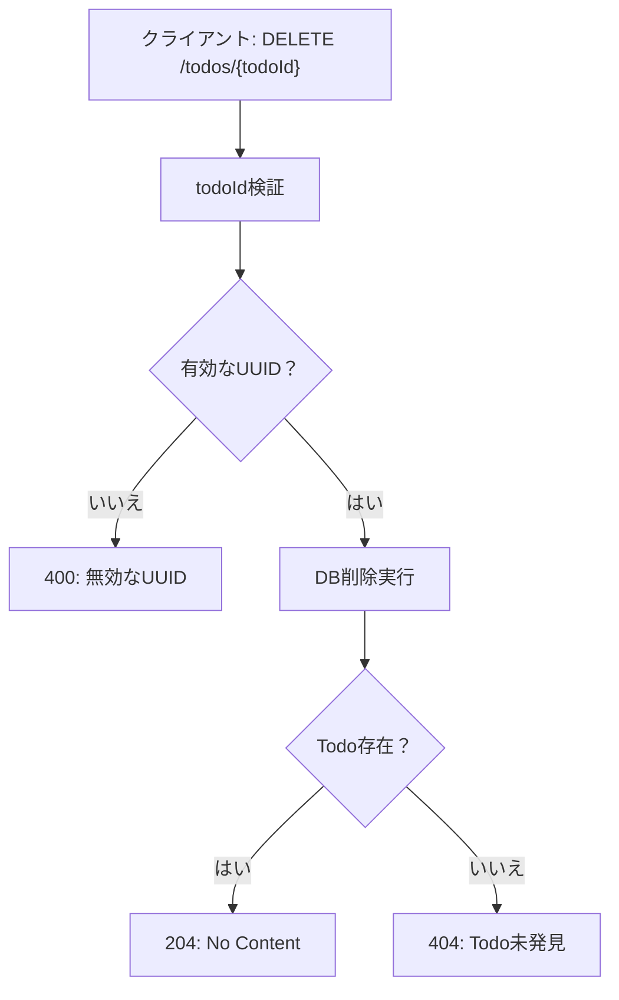

# Todo API 処理フロー図

## 1. GET /todos - Todo一覧取得

## 2. POST /todos - Todo作成

## 3. GET /todos/{todoId} - 特定Todo取得

## 4. PUT /todos/{todoId} - Todo更新

## 5. DELETE /todos/{todoId} - Todo削除

## HTTPステータスコード一覧

| ステータス | 説明 | 使用場面 |
|---------|------|---------|
| 200 | OK | 取得・更新成功 |
| 201 | Created | 作成成功 |
| 204 | No Content | 削除成功 |
| 400 | Bad Request | 不正なリクエスト/UUID |
| 404 | Not Found | Todo未発見 |
| 500 | Internal Server Error | サーバーエラー |